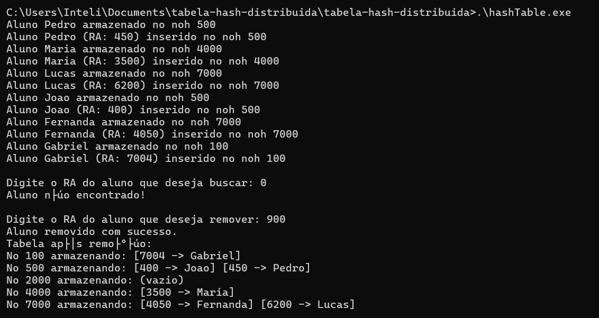

# Testes Realizados
## Ponderada semana 02 módulo 05

Neste repositório serão documentados todos os testes feitos nos códigos da pasta *'tabela-hash-distribuidas'* com seus respectivos arquivos demonstrativos.

### Teste 01 - Adição de Alunos dentro do intervalo 0-7000

Um novo aluno chamado "Fernanda" é adicionado no vetor Aluno com um ra correspondente de 4050.

Quando o código é compilado, o aluno "Fernanda" é adicionado à hash table dentro do nó 7000, o nó mais próximo com um número maior que 4050.

E ao procurar por este mesmo aluno utilizando seu ra correspondente, ele é encontrado com sucesso dentro de seu nó

### Teste 02 - Adição de Alunos em um intervalo acima de 7000

Um novo aluno chamado "Gabriel" é adicionado no vetor Aluno com um ra correspondente de 7004.

Quando o código é compilado, o aluno "Gabriel" é adicionado à hash table dentro do nó 100, o primeiro nó da cadeia. Isso ocorre pela a característica circular da hash table determinada em **allNodes.front()** caso não haja nó igual ou maior que o ra selecionado. E ao procurar por este mesmo aluno utilizando seu ra correspondente, ele é encontrado com sucesso dentro de seu nó

### Teste 03 - Remoção de Alunos existentes

É selecionado o aluno "Maria" de ra correspondente 3500 para remoção.

O ra é encontrado e removido com sucesso da hash table, deixando de aparecer nos registros de alunos.

No entanto, quando a tabela é atualizada novamente, o registro do aluno "Maria" volta a aparecer. Isso significa que ele não foi excluido da memória da máquina.

### Teste 04 - Remoção de Alunos inexistentes

Quando há a tentativa de excluir um aluno inexistente com ra correspondente a 900, o sistema imprime que ele foi removido com sucesso, apesar de que quando há uma tentativa de encontrar um aluno inexistente com ra 0, o sistema retorna "Aluno não encontrado".

No entanto, ao analisar o código, a remoção de um aluno com ra inexistente deveria retornar **"Aluno não encontrado para remoção.\n"**, demonstrando um erro neste método.

### Teste 05 - Cadastro de dois Alunos com o mesmo ra

Quando há a tentativa de cadastrar dois alunos com o mesmo ra, utilizando de exemplo o aluno "Gabriel" e um novo aluno "Ana", ambos possuindo o ra 7004, o sistema lista ambos como parte do nó.

No entanto, quando faz-se uma busca pelo ra correspondente, é imprimido apenas o nome do último cadastrado, no caso, de "Ana".

E por fim, quando há uma exclusão do nome associado ao ra, nenhum dos associados ao número aparece no nó correspondente.

